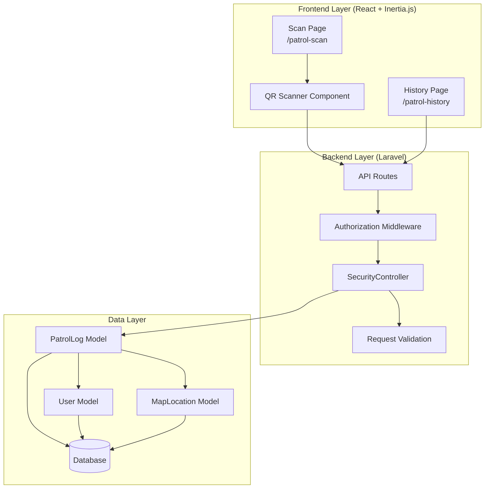
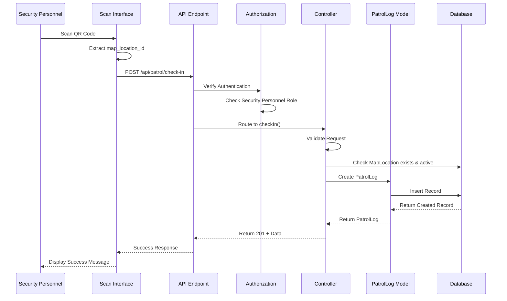
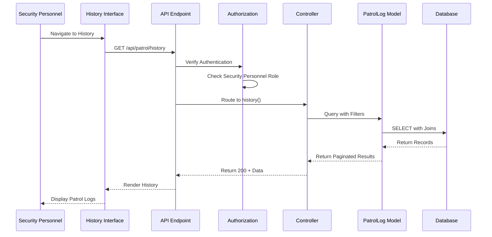

# Design Document: Patrol Scanning System

## Overview

The Patrol Scanning System enables Security Personnel to check in at designated patrol points throughout the MLUC campus by scanning QR codes. This feature integrates seamlessly with the existing Laravel + React (Inertia.js) application, leveraging the established MapLocation infrastructure and following existing architectural patterns.

### Key Design Decisions

1. **QR Code Format**: Based on the existing scanner implementation in `resources/js/pages/shared/report.tsx`, QR codes will contain the `map_location_id` directly as a numeric string (e.g., "123"). This matches the pattern used for vehicle QR codes and simplifies parsing.

2. **Database Schema**: The `patrol_logs` table follows Laravel conventions with foreign key constraints, timestamps, and proper indexing for query performance.

3. **API Design**: RESTful endpoints following the existing controller patterns, with proper validation, authorization, and error handling.

4. **Frontend Integration**: Minimal changes to existing scan and history pages, leveraging the existing QR scanner component and UI patterns.

## Architecture

### High-Level Architecture



### Data Flow

#### Check-In Flow



#### History Retrieval Flow



## Components and Interfaces

### Database Schema

#### patrol_logs Table

```sql
CREATE TABLE patrol_logs (
    id BIGINT UNSIGNED AUTO_INCREMENT PRIMARY KEY,
    security_user_id BIGINT UNSIGNED NOT NULL,
    map_location_id BIGINT UNSIGNED NOT NULL,
    checked_in_at DATETIME NOT NULL,
    notes TEXT NULL,
    created_at TIMESTAMP NULL,
    updated_at TIMESTAMP NULL,
    
    FOREIGN KEY (security_user_id) REFERENCES users(id) ON DELETE CASCADE,
    FOREIGN KEY (map_location_id) REFERENCES map_locations(id) ON DELETE CASCADE,
    
    INDEX idx_security_user_id (security_user_id),
    INDEX idx_map_location_id (map_location_id),
    INDEX idx_checked_in_at (checked_in_at)
);
```

**Column Descriptions:**
- `id`: Primary key, auto-incrementing
- `security_user_id`: Foreign key to users table, identifies the Security Personnel who checked in
- `map_location_id`: Foreign key to map_locations table, identifies the patrol point
- `checked_in_at`: Timestamp when the check-in occurred (set to current time on creation)
- `notes`: Optional text field for Security Personnel to add observations or comments
- `created_at`, `updated_at`: Laravel timestamps for record tracking

**Indexes:**
- Primary key on `id` for fast lookups
- Index on `security_user_id` for efficient user-specific queries
- Index on `map_location_id` for location-based queries
- Index on `checked_in_at` for chronological sorting and date range queries

### Backend Components

#### PatrolLog Model

**File:** `app/Models/PatrolLog.php`

```php
<?php

namespace App\Models;

use Illuminate\Database\Eloquent\Model;
use Illuminate\Database\Eloquent\Relations\BelongsTo;

class PatrolLog extends Model
{
    protected $fillable = [
        'security_user_id',
        'map_location_id',
        'checked_in_at',
        'notes',
    ];

    protected function casts(): array
    {
        return [
            'checked_in_at' => 'datetime',
        ];
    }

    /**
     * The Security Personnel who performed the check-in.
     */
    public function securityUser(): BelongsTo
    {
        return $this->belongsTo(User::class, 'security_user_id');
    }

    /**
     * The patrol point location.
     */
    public function location(): BelongsTo
    {
        return $this->belongsTo(MapLocation::class, 'map_location_id');
    }
}
```

#### Model Relationship Updates

**User Model** (`app/Models/User.php`):
```php
public function patrolLogs(): HasMany
{
    return $this->hasMany(PatrolLog::class, 'security_user_id');
}
```

**MapLocation Model** (`app/Models/MapLocation.php`):
```php
public function patrolLogs(): HasMany
{
    return $this->hasMany(PatrolLog::class);
}
```

#### API Controller

**File:** `app/Http/Controllers/Security/SecurityController.php`

**New Methods:**

```php
/**
 * Record a patrol check-in.
 */
public function checkIn(Request $request): JsonResponse
{
    $validated = $request->validate([
        'map_location_id' => 'required|numeric|exists:map_locations,id',
        'notes' => 'nullable|string|max:1000',
    ]);

    // Verify the location is active
    $location = MapLocation::findOrFail($validated['map_location_id']);
    
    if (!$location->is_active) {
        return response()->json([
            'message' => 'This patrol point is no longer active. Please contact administration.',
        ], 422);
    }

    // Create the patrol log
    $patrolLog = PatrolLog::create([
        'security_user_id' => auth()->id(),
        'map_location_id' => $validated['map_location_id'],
        'checked_in_at' => now(),
        'notes' => $validated['notes'] ?? null,
    ]);

    // Load relationships for response
    $patrolLog->load('location');

    return response()->json([
        'message' => 'Check-in recorded successfully.',
        'data' => $patrolLog,
    ], 201);
}

/**
 * Get patrol history for the authenticated user.
 */
public function getHistory(Request $request): JsonResponse
{
    $logs = PatrolLog::where('security_user_id', auth()->id())
        ->with('location')
        ->orderBy('checked_in_at', 'desc')
        ->paginate(15);

    return response()->json($logs);
}
```

#### API Routes

**File:** `routes/web.php`

```php
// Security Operations (Patrol Routes)
Route::middleware(['auth', 'role:Security Personnel'])->group(function () {
    // Existing routes
    Route::get('patrol-scan', [SecurityController::class, 'scan'])->name('security.scan');
    Route::get('patrol-history', [SecurityController::class, 'history'])->name('security.history');
    
    // New API routes
    Route::post('api/patrol/check-in', [SecurityController::class, 'checkIn'])->name('api.patrol.check-in');
    Route::get('api/patrol/history', [SecurityController::class, 'getHistory'])->name('api.patrol.history');
});
```

### Frontend Components

#### QR Code Parsing Logic

Based on the existing scanner implementation in `resources/js/pages/shared/report.tsx`, the QR code scanner reads `result[0].rawValue` directly. For patrol points:

**QR Code Format:**
- Primary format: Numeric `map_location_id` only (e.g., "123", "456")
- Fallback format: "PATROL_POINT:123" (for backward compatibility)

**Parsing Logic:**
```typescript
const parsePatrolQR = (rawValue: string): number | null => {
    // Try parsing as direct numeric ID
    const numericId = parseInt(rawValue, 10);
    if (!isNaN(numericId)) {
        return numericId;
    }
    
    // Try parsing with prefix
    if (rawValue.startsWith('PATROL_POINT:')) {
        const id = parseInt(rawValue.split(':')[1], 10);
        if (!isNaN(id)) {
            return id;
        }
    }
    
    return null;
};
```

#### Scan Page Updates

**File:** `resources/js/pages/security/scan.tsx`

**Key Changes:**
1. Add API call to `/api/patrol/check-in` after successful QR scan
2. Display success message with patrol point name and timestamp
3. Handle validation and network errors
4. Clear notes field after successful check-in

**Example Implementation:**
```typescript
const handleScan = async (result: any) => {
    if (!result || !result[0]?.rawValue) return;
    
    const rawValue = result[0].rawValue;
    const mapLocationId = parsePatrolQR(rawValue);
    
    if (!mapLocationId) {
        toast.error('Invalid QR code format. Please scan a patrol point QR code.');
        return;
    }
    
    stopScanner();
    
    try {
        const response = await axios.post(route('api.patrol.check-in'), {
            map_location_id: mapLocationId,
            notes: notesValue,
        });
        
        toast.success(`Check-in recorded at ${response.data.data.location.name}`);
        setNotesValue(''); // Clear notes for next scan
        
    } catch (error) {
        if (error.response?.status === 422) {
            toast.error(error.response.data.message);
        } else {
            toast.error('An error occurred while recording your check-in. Please try again.');
        }
    }
};
```

#### History Page Updates

**File:** `resources/js/pages/security/history.tsx`

**Key Changes:**
1. Fetch patrol history from `/api/patrol/history` on page load
2. Display patrol logs in a table or card layout
3. Format timestamps in human-readable format
4. Implement pagination controls
5. Show loading state and empty state

**Example Data Structure:**
```typescript
interface PatrolLog {
    id: number;
    security_user_id: number;
    map_location_id: number;
    checked_in_at: string; // ISO datetime
    notes: string | null;
    location: {
        id: number;
        name: string;
        short_code: string;
    };
}
```

## Data Models

### PatrolLog Entity

**Attributes:**
- `id`: Unique identifier (bigint, auto-increment)
- `security_user_id`: Reference to User (bigint, foreign key)
- `map_location_id`: Reference to MapLocation (bigint, foreign key)
- `checked_in_at`: Check-in timestamp (datetime)
- `notes`: Optional observations (text, nullable)
- `created_at`: Record creation timestamp (timestamp)
- `updated_at`: Record update timestamp (timestamp)

**Relationships:**
- `securityUser`: BelongsTo User (one-to-many inverse)
- `location`: BelongsTo MapLocation (one-to-many inverse)

**Validation Rules:**
- `security_user_id`: Required, must exist in users table
- `map_location_id`: Required, must exist in map_locations table, location must be active
- `checked_in_at`: Required, valid datetime
- `notes`: Optional, max 1000 characters

### User Entity Updates

**New Relationship:**
- `patrolLogs`: HasMany PatrolLog (one-to-many)

### MapLocation Entity Updates

**New Relationship:**
- `patrolLogs`: HasMany PatrolLog (one-to-many)

## Error Handling

### Validation Errors

| Error Condition | HTTP Status | Error Message |
|----------------|-------------|---------------|
| Invalid map_location_id | 422 | "Invalid patrol point. Please scan a valid QR code." |
| Inactive patrol point | 422 | "This patrol point is no longer active. Please contact administration." |
| Invalid QR format | 422 | "Invalid QR code format. Please scan a patrol point QR code." |
| Notes too long | 422 | "Notes cannot exceed 1000 characters." |
| Missing required field | 422 | "The {field} field is required." |

### Authorization Errors

| Error Condition | HTTP Status | Error Message |
|----------------|-------------|---------------|
| Not authenticated | 401 | "Unauthenticated." |
| Not Security Personnel | 403 | "Unauthorized. Only Security Personnel can check in at patrol points." |

### System Errors

| Error Condition | HTTP Status | Error Message |
|----------------|-------------|---------------|
| Database error | 500 | "An error occurred while recording your check-in. Please try again." |
| Network error | N/A | "Network error. Please check your connection and try again." |

### Error Handling Strategy

1. **Backend Validation**: Use Laravel's built-in validation for all API requests
2. **Database Constraints**: Foreign key constraints ensure referential integrity
3. **Authorization Middleware**: Role-based middleware prevents unauthorized access
4. **Try-Catch Blocks**: Wrap database operations in try-catch for graceful error handling
5. **Frontend Error Display**: Use toast notifications for user-friendly error messages
6. **Logging**: Log all system errors for debugging and monitoring

## Testing Strategy

### Unit Tests

**Backend Unit Tests:**

1. **PatrolLog Model Tests**
   - Test fillable attributes
   - Test datetime casting for `checked_in_at`
   - Test `securityUser` relationship
   - Test `location` relationship

2. **SecurityController Tests**
   - Test `checkIn()` with valid data
   - Test `checkIn()` with invalid map_location_id
   - Test `checkIn()` with inactive location
   - Test `checkIn()` with notes exceeding max length
   - Test `checkIn()` without authentication
   - Test `checkIn()` without Security Personnel role
   - Test `getHistory()` returns only user's logs
   - Test `getHistory()` pagination
   - Test `getHistory()` ordering (most recent first)

3. **Validation Tests**
   - Test map_location_id validation rules
   - Test notes validation rules
   - Test foreign key constraints

**Frontend Unit Tests:**

1. **QR Parsing Tests**
   - Test parsing numeric ID (e.g., "123")
   - Test parsing with prefix (e.g., "PATROL_POINT:123")
   - Test invalid formats return null
   - Test non-numeric values return null

2. **Scan Page Tests**
   - Test successful check-in flow
   - Test error handling for validation errors
   - Test error handling for network errors
   - Test notes field clearing after success

3. **History Page Tests**
   - Test data fetching on mount
   - Test pagination controls
   - Test empty state display
   - Test loading state display
   - Test timestamp formatting

### Integration Tests

1. **End-to-End Check-In Flow**
   - Security Personnel scans QR code
   - System validates and records check-in
   - Success message displays with location name
   - Check-in appears in history

2. **Authorization Flow**
   - Non-authenticated user cannot access endpoints
   - Non-Security Personnel user receives 403 error
   - Security Personnel can access all features

3. **Database Integrity**
   - Foreign key constraints prevent orphaned records
   - Cascade deletes work correctly
   - Indexes improve query performance

### Test Data

**Sample Patrol Logs:**
```php
[
    [
        'security_user_id' => 1,
        'map_location_id' => 5,
        'checked_in_at' => '2024-01-15 14:30:00',
        'notes' => 'All clear, no issues observed.',
    ],
    [
        'security_user_id' => 1,
        'map_location_id' => 12,
        'checked_in_at' => '2024-01-15 15:45:00',
        'notes' => null,
    ],
]
```

**Sample MapLocations:**
```php
[
    [
        'id' => 5,
        'name' => 'Main Gate',
        'short_code' => 'MG',
        'is_active' => true,
    ],
    [
        'id' => 12,
        'name' => 'Library Entrance',
        'short_code' => 'LIB',
        'is_active' => true,
    ],
    [
        'id' => 20,
        'name' => 'Old Checkpoint',
        'short_code' => 'OLD',
        'is_active' => false,
    ],
]
```

## Implementation Notes

### Migration Order

1. Create `patrol_logs` table migration
2. Run migration: `php artisan migrate`
3. Create PatrolLog model
4. Update User and MapLocation models with relationships
5. Add controller methods
6. Add API routes
7. Update frontend components

### QR Code Generation

QR codes for patrol points should be generated by administrators through the admin panel. The QR code should contain only the `map_location_id` as a numeric string.

**Example QR Code Content:**
- For map_location_id = 5: QR code contains "5"
- For map_location_id = 123: QR code contains "123"

This matches the existing pattern used for vehicle QR codes in the system.

### Performance Considerations

1. **Database Indexes**: Indexes on `security_user_id`, `map_location_id`, and `checked_in_at` ensure fast queries
2. **Pagination**: History endpoint uses pagination (15 records per page) to prevent large data transfers
3. **Eager Loading**: Use `with('location')` to prevent N+1 query problems
4. **Caching**: Consider caching active map locations for faster validation

### Security Considerations

1. **Authorization**: Role-based middleware ensures only Security Personnel can access patrol features
2. **Input Validation**: All user inputs are validated before database operations
3. **SQL Injection Prevention**: Laravel's Eloquent ORM prevents SQL injection
4. **CSRF Protection**: Laravel's CSRF middleware protects API endpoints
5. **Foreign Key Constraints**: Database constraints ensure data integrity

### Future Enhancements

1. **Admin Dashboard**: Allow administrators to view all patrol logs across all Security Personnel
2. **Reporting**: Generate patrol coverage reports and analytics
3. **Geolocation**: Add GPS coordinates to verify physical presence at patrol points
4. **Photo Evidence**: Allow Security Personnel to attach photos to check-ins
5. **Scheduled Patrols**: Define expected patrol routes and schedules
6. **Alerts**: Notify supervisors of missed patrol points or overdue check-ins
